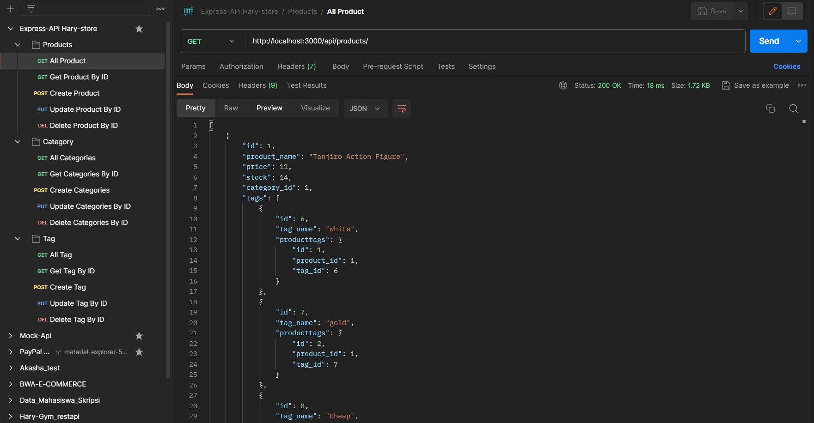

## Hary-Store (Mini E-commerce Backend)

### Description App

Hary-store (mini E-Commerce backend) ini merupakan fondasi yang solid untuk pengembangan situs E-commerce fiksi. tujuannya untuk berlatih backend dan menyelesaikan tugas backend, Menggunakan Express.js API dan Sequelize untuk berinteraksi dengan MySQL database, aplikasi ini menyimpan data product, categories, tags, dan tags product. Dengan routes API yang disediakan, pengguna dapat dengan mudah melakukan operasi CRUD pada database, memberikan pengalaman pengembangan backend yang efisien dan mendukung fungsionalitas dasar situs E-commerce.

### Installation App

Untuk instalasi, Ikuti Instruksi Berikut ini:
- Buka Command Prompt
- Clone Project App dengan perintah : `git clone https://github.com/harymahayana07/hary-store-express.git`
- Arahkan ke project app yang telah di clone, contohnya: `cd hary-store-express`
- Lakukan `npm install` untuk menginstall dependencies yang dibutuhkan

### Usage App

#### Database Configuration
- Buat File .env, yang isinya :
DB_NAME=nama_db_anda
DB_USER=root
DB_PASSWORD=pw_anda
DB_HOST=localhost
- Buat file src/config/config.json dan isi file config.json dengan kode berikut:
{
  "development": {
    "username": "root",
    "password": "pw_anda",
    "database": "nama_db_anda",
    "host": "127.0.0.1",
    "dialect": "mysql"
  }
}
- Buat Database dengan perintah `CREATE DATABASE nama_database;`
- Setelah terbuat check db dengan perintah `SHOW DATABASES;`
- dalam script package.json telah di custom untuk migrate, untuk melakukan migrate `npm run migrate` atau `npx sequelize-cli db:migrate`
- Setelah itu check migrasi dalam mysql dengan perintah `USE nama_db_anda` dan `SHOW TABLES;` dan `SHOW COLUMNS FROM nama_tabel;`
- Setelah itu lakukan seeders, dengan perintah custom Scripts di Package.json `npm run seed` atau `npx sequelize-cli db:seed:all`
- Check isi tabel dalam database mysql anda dengan perintah `SELECT * FROM nama_tabel;`

#### Running App 
- Jalankan perintah `npm run start` untuk start server express app 
- Buka API testing application seperti [Insomnia Core](https://insomnia.rest/download) atau [Postman](https://www.postman.com/) untuk testing routes API.
- Server running pada `http://localhost:3000/` , sehingga untuk routes-nya sebagai berikut:
- Get Routes:
    - `http://localhost:3000/api/products/` to view all products.
    - `http://localhost:3000/api/categories/` to view all categories.
    - `http://localhost:3000/api/tags/ `to view all tags.
    - `http://localhost:3000/api/products/<:id>` to get a specific product based on id.
    - `http://localhost:3000/api/categories/<:id>` to get a specific category based on id.
    - `http://localhost:3000/api/tags/<:id> `to get a specific tag based on id.
- Post Routes:
    - `http://localhost:3000/api/products/` to create a new product.
    - `http://localhost:3000/api/categories/` to create a new category.
    - `http://localhost:3000/api/tags/ `to create a new tag.
- Put and Delete Routes:
    - `http://localhost:3000/api/products/<:id>` to update or delete product based on id.
    - `http://localhost:3000/api/categories/<:id>` to update or delete category based on id.
    - `http://localhost:3000/api/tags/<:id> `to update or delete tag based on id.

- Pengaplikasian di POSTMAN : 

### Technologies
- javaScript
- Express.JS
- Mysql
- Sequelize  
